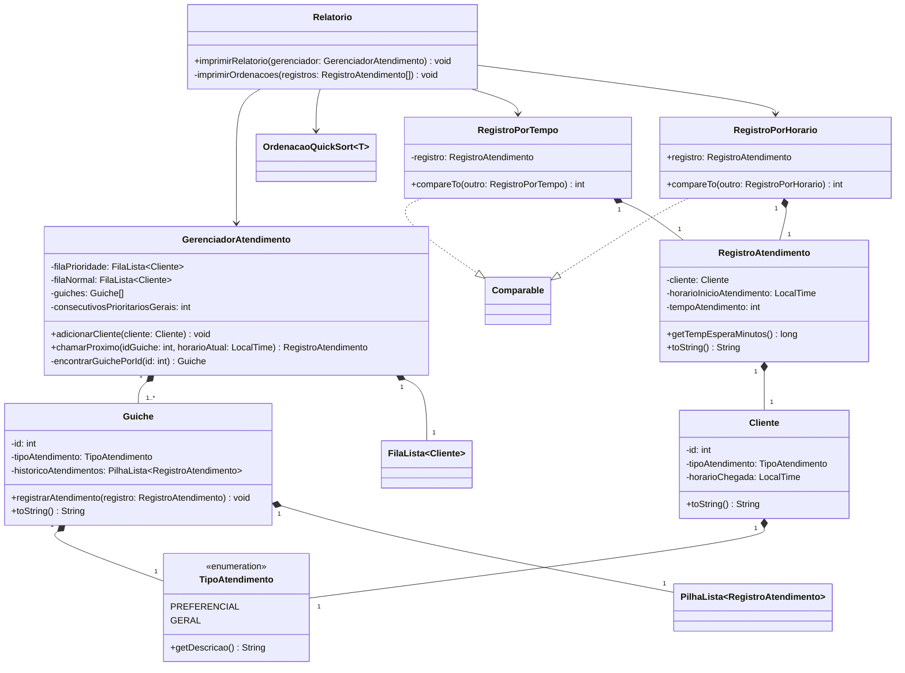
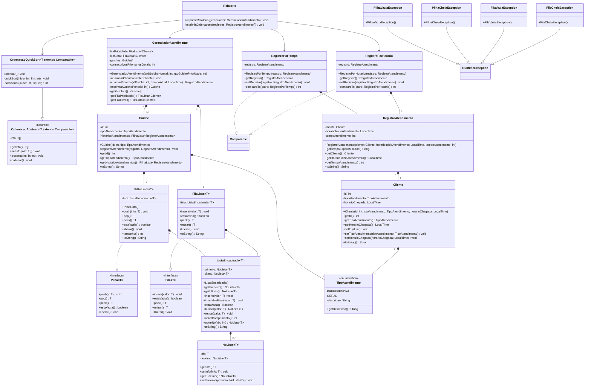

# Sistema gerenciador de fila de atendimento bancário 
## Diagrama de classes simplificado
Contém as classes do projeto com exceção das classes de estruturas de dados

## Diagrama de classes completo
Contém o diagrama de todas as classes, inclusive relativo às classes das estruturas de dados.
