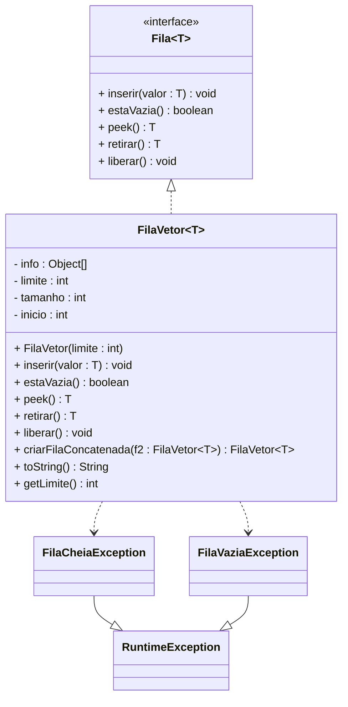
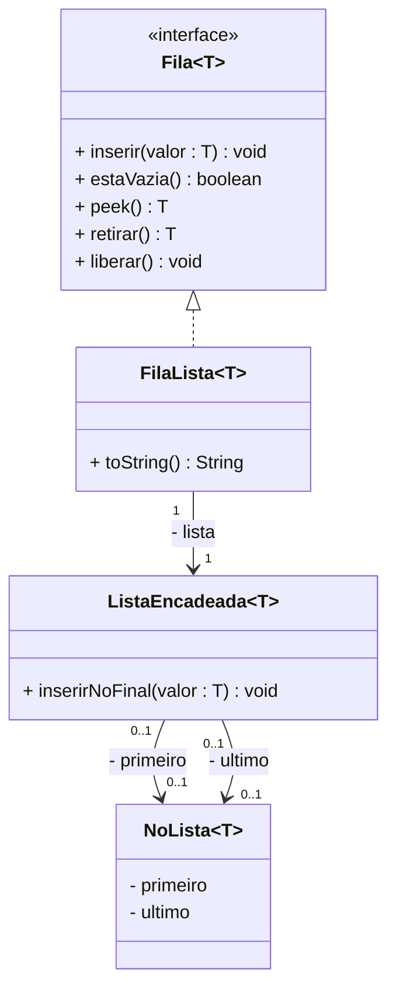

# Lista de Exercícios 06

**UNIVERSIDADE REGIONAL DE BLUMENAU**  
**CENTRO DE CIÊNCIAS EXATAS E NATURAIS**  
**DEPARTAMENTO DE SISTEMAS E COMPUTAÇÃO**  
**PROFESSOR GILVAN JUSTINO**  
**ALGORITMOS E ESTRUTURAS DE DADOS**

---

O objetivo desta lista de exercícios é exercitar a implementação de filas. Crie um novo projeto para resolver as questões abaixo.

---

## Questão 1

Realizar a implementação de filas utilizando vetor, conforme diagrama abaixo:



Sendo que:

- **`FilaVetor(int)`**: Construtor que deve inicializar a fila com capacidade de armazenamento igual ao valor do parâmetro.

- **`inserir(T)`**: Este método deve enfileirar o dado fornecido como argumento. Caso a fila não tenha espaço disponível, o método deverá lançar a exceção `FilaCheiaException`.

- **`estaVazia():boolean`**: Este método deve avaliar se a fila está vazia ou não, retornando `true` se a fila estiver vazia e `false` se não estiver.

- **`peek():T`**: Este método deve retornar o dado que estiver armazenado no início da fila. Caso a fila esteja vazia, o método deverá lançar a exceção `FilaVaziaException`.

- **`retirar():T`**: Este método deve desenfileirar um dado da fila. Caso a fila esteja vazia, o método deverá lançar a exceção `FilaVaziaException`.

- **`liberar()`**: O método liberar deve desenfileirar todos os dados da fila.

- **`criarFilaConcatenada(f2: FilaVetor): FilaVetor`**: Este método deve criar uma nova fila, a partir da concatenação de duas filas previamente existentes: a fila do objeto que executar o método `criarFilaConcatenada()`, aqui denominada de **f1**, e a fila recebida como argumento, denominada de **f2**. Observe a ilustração abaixo, que apresenta duas filas originais e seus elementos corretamente inseridos numa nova fila resultante (f3).

`O símbolo ↑ representa o início da lista`

  | f1 (índices 0–7) |   |   | 3 | 1 | 5 |   |   |   |
  |------------------|---|---|---|---|---|---|---|---|
  |                  | 0 | 1 | 2 | 3 | 4 | 5 | 6 | 7 |
  |                  |   |   | ↑ |   |   |   |   |

  | f2 (índices 0–9) | 11 | 6 |   |   |   |   |   | 25 | 17 | -1 |
  |------------------|----|---|---|---|---|---|---|----|----|----|
  |                  | 0  | 1 | 2 | 3 | 4 | 5 | 6 | 7  | 8  | 9  |
  |                  |    |   |   |   |   |   |   |  ↑ |    |    |

  ```
  FilaVetor f3 = f1.criarFilaConcatenada(f2)
  ```

  | f3 (Vetor de saída) | 3 | 1 | 5 | 25 | 17 | -1 | 11 | 6 |   |   |   |   |   |   |   |   |   |   |
  |---------------------|---|---|---|----|----|----|----|---|---|---|---|---|---|---|---|---|---|---|
  |                     | 0 | 1 | 2 | 3  | 4  | 5  | 6  | 7 | 8 | 9 | 10| 11| 12| 13| 14| 15| 16| 17|


  > Observe que a fila resultante tem como tamanho a soma do tamanho dos vetores das filas originais.

- **`toString(): String`**: Este método deve retornar uma string contendo os dados armazenados na fila, desde o primeiro elemento (início da fila), até o último, separando-os por vírgula.

- **`getLimite(): int`**: Este método deve retornar a capacidade máxima da fila.

---

## Questão 2

Implemente o seguinte plano de testes.

### Plano de testes PL01 – Validar funcionamento da implementação estática de fila

| Caso | Descrição | Entrada | Saída esperada |
|------|-----------|---------|----------------|
| 1 | Conferir se o método `estaVazia()` reconhece fila vazia. | Criar uma fila de inteiros. | Ao invocar `estaVazia()` deve resultar em `true`. |
| 2 | Conferir se o método `estaVazia()` reconhece fila não vazia. | Criar fila de inteiros com capacidade de 5 elementos. Enfileirar o número 10. | Ao invocar `estaVazia()` deve resultar em `false`. |
| 3 | Conferir se os dados são enfileirados e desenfileirados corretamente. | Criar uma fila de inteiros com capacidade de 10 elementos. Enfileirar os dados 10, 20 e 30, nesta ordem. | Desenfileirar um dado. Deve ser retornado 10. Desenfileirar outro dado. Deve ser retornado 20. Desenfileirar outro dado. Deve ser retornado 30. O método `estaVazia()` deve resultar em `true`. |
| 4 | Conferir se a exceção `FilaCheiaException` é lançada ao tentar exceder a capacidade da fila. | Criar uma fila de inteiros com capacidade de 3 elementos. Enfileirar os dados: 10, 20, 30 e 40. | A exceção `FilaCheiaException` deve ser lançada. |
| 5 | Conferir se a exceção `FilaVaziaException` é lançada ao tentar desenfileirar dados de uma fila vazia. | Criar uma fila de inteiros. Desenfileirar um dado. | A exceção `FilaVaziaException` deve ser lançada. |
| 6 | Conferir se o método `peek()` retorna o início da fila. | Criar uma fila de inteiros com capacidade de 5 elementos. Enfileirar os dados 10, 20 e 30 (nesta ordem). Conferir o início da fila. | Deve retornar 10. Em seguida, retirar um elemento da fila. Deve resultar em 10 também. |
| 7 | Conferir se o método `liberar()` remove os elementos da fila. | Criar uma fila de inteiros com capacidade de 5 elementos. Enfileirar os dados 10, 20, 30. Limpar a fila. | O método `estaVazia()` deve resultar em `true`. |
| 8 | Conferir a concatenação de filas. | Criar uma fila de inteiros com capacidade de 5 elementos e enfileirar os dados 10, 20 e 30 (nesta ordem). Criar outra fila de inteiros com capacidade de 3 elementos e adicionar os dados 40 e 50. Concatenar as duas filas (1ª fila + 2ª fila). | Ao utilizar `toString()` da fila resultante deve ser `10,20,30,40,50`. As filas originais, utilizadas na concatenação, não podem ser modificadas. Validar, invocando `toString()` para a primeira fila. Deverá resultar em `"10,20,30"`. Invocar `toString()` para a segunda fila, deverá resultar em `"40,50"`. Validar que a capacidade de armazenamento da fila resultante seja de 8 elementos. |

---

## Questão 3

Implemente uma fila utilizando a estrutura de dados de lista encadeada, conforme apresentado no diagrama seguinte.

Os dados da fila deverão ficar armazenados numa lista encadeada que seja capaz de armazenar dados a partir da extremidade oposta ao primeiro elemento, isto é, no final da lista encadeada. Portanto, será necessário utilizar uma lista encadeada com acesso às duas extremidades da estrutura.

Para solucionar esta questão, será necessário implementar uma lista simplesmente encadeada com acesso às duas extremidades. Copie a implementação de lista simplesmente encadeada desenvolvida na lista de exercícios 3 para o projeto atual e acrescente o método `inserirNoFinal()`, além de adaptá-la para tratar da associação `ultimo`.



A classe `FilaLista` deve implementar todos os métodos da interface `Fila`, além do método `toString()`, que deve retornar o conteúdo da fila, partindo do início da fila, até o último, separando os dados por vírgula.

---

## Questão 4

Implemente o seguinte plano de testes para validar sua implementação dinâmica de fila.

### Plano de testes PL02 – Validar funcionamento da implementação dinâmica de fila

| Caso | Descrição | Entrada | Saída esperada |
|------|-----------|---------|----------------|
| 1 | Conferir se o método `estaVazia()` reconhece fila vazia. | Criar uma fila de inteiros. | Ao invocar `estaVazia()` deve resultar em `true`. |
| 2 | Conferir se o método `estaVazia()` reconhece fila não vazia. | Criar uma fila de inteiros. Enfileirar o número 10. | Ao invocar `estaVazia()` deve resultar em `false`. |
| 3 | Conferir se os dados são enfileirados e desenfileirados corretamente. | Criar uma fila de inteiros. Enfileirar os dados 10, 20 e 30, nesta ordem. | Desenfileirar um dado. Deve ser retornado 10. Desenfileirar outro dado. Deve ser retornado 20. Desenfileirar outro dado. Deve ser retornado 30. Após estas operações, o método `estaVazia()` deve resultar em `true`. |
| 4 | Conferir se o método `peek()` retorna o início da fila. | Criar uma fila de inteiros. Enfileirar os dados 10, 20 e 30 (nesta ordem). Conferir o início da fila. | Deve retornar 10. Em seguida, retirar um elemento da fila. Deve resultar em 10. |
| 5 | Conferir se o método `liberar()` remove os elementos da fila. | Criar uma fila de inteiros. Enfileirar os dados 10, 20, 30. Limpar a fila. | O método `estaVazia()` deve resultar em `true`. |