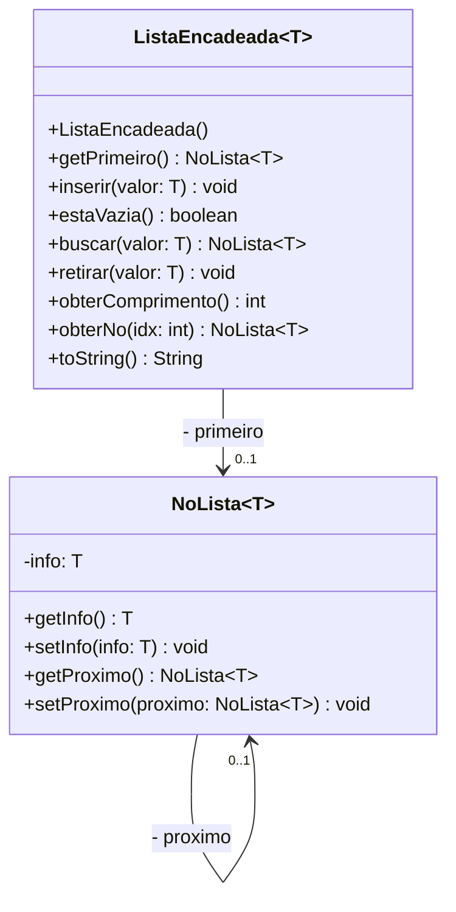

UNIVERSIDADE REGIONAL DE BLUMENAU

**FURB** **CENTRO DE CIÊNCIAS EXATAS E NATURAIS** **DEPARTAMENTO DE SISTEMAS E COMPUTAÇÃO** **PROFESSOR GILVAN JUSTINO**

**ALGORITMOS E ESTRUTURAS DE DADOS** **Lista de Exercícios 03**

---

Questão 1

Implementar em Java as classes `ListaEncadeada` e `NoLista`, de acordo com o diagrama de classes da figura abaixo.

A descrição dos métodos da classe `ListaEncadeada` a serem implementados consta abaixo:

* **a) `ListaEncadeada()`:** construtor da classe. Deve definir que a lista está vazia.

*
**b) `getPrimeiro()`:** método getter da variável primeiro.

*
**c) `inserir(T)`:** Deve inserir um novo nó no início da lista. Este novo nó deve armazenar o valor recebido na variável paramétrica info.

*
**d) `estaVazia()`:** Deve retornar true se a lista estiver vazia ou false se tiver algum nó encadeado.

*
**e) `buscar(T)`:** Deve procurar na lista encadeada se há um nó cujo conteúdo seja igual à variável info.  Caso seja localizado, deverá retornar este nó (objeto da classe `NoLista`). Se não for localizado, deverá retornar null.

*
**f) `retirar(T)`:** Deve remover o primeiro nó que for encontrado que contiver o dado fornecido como argumento.

*
**g) `obterComprimento()`:** Deverá retornar a quantidade de nós encadeados na lista. Implemente este método sem criar nova variável de instância (atributos) na classe `ListaEncadeada`.

*
**h) `obterNo(int)`:** o método deverá retornar o nó que está na posição fornecida como argumento. Considere que o primeiro nó tem posição igual à 0 e que o último nó (aquele que está na extremidade oposta ao primeiro), está na posição Comprimento-1. Caso o argumento fornecido ao método `obterNo()` seja negativo ou maior que o comprimento da lista, deverá ser lançada a exceção `java.lang.IndexOutOfBoundsException`. O algoritmo não pode percorrer a lista mais de uma vez.

*
**i) `toString()`:** este método deve retornar o conteúdo armazenado na lista, separando os dados por vírgula.

---

Questão 2

Implemente o seguinte plano de testes:

**Plano de testes PL01 - Validar funcionamento da classe Lista Encadeada**

| Caso | Descrição | Entrada | Saída esperada |
| :--- | :--- | :--- | :--- |
| **1** | Verificar se é reconhecida lista vazia | Apenas construir a lista | `estaVazia() = true` |
| **2** | Verificar se é reconhecida lista não vazia | Adicionar o número 5 na lista | `estaVazia() = false` |
| **3** | Validar inclusão de um número | Adicionar o número 5 na lista | Obter o primeiro objeto da lista. Conferir que tenha sido retornado nó e o nó contenha 5. Certificar-se que não haja mais nós. |
| **4** | Validar inclusão de 3 números | Adicionar os números 5, 10, 15 nesta ordem | Obter os objetos da lista e certificar-se que hajam apenas 3 nós e os valores devem ser 15, 10 e 5 (nesta ordem). |
| **5** | Validar busca de dados na lista na primeira posição | Adicionar os números 5, 10, 15 e 20-nesta ordem. Buscar o número 20 | Certificar-se que o método `buscar()` retorne um nó contendo o número 20 |
| **6** | Validar busca de dados no meio da lista | Adicionar os números 5, 10, 15 e 20-nesta ordem. Buscar o número 15 | Certificar-se que o método `buscar()` retorne um nó contendo o número 15 |
| **7** | Validar busca de dado inexistente | Adicionar os números 5, 10, 15 e 20-nesta ordem. Buscar o número 50 | `buscar()` deve resultar `null`. |
| **8** | Validar exclusão de primeiro elemento da lista | Adicionar os números 5, 10, 15 e 20-nesta ordem. Solicitar exclusão de número 20 | Após o algoritmo de remoção, navegar na lista e certificar-se que a lista contenha exclusivamente os números 5, 10 e 15. |
| **9** | Validar exclusão de elemento do meio da lista | Adicionar os números 5, 10, 15 e 20-nesta ordem. Solicitar exclusão de número 15 | Após o algoritmo de remoção, navegar na lista e certificar-se que a lista contenha exclusivamente os números 5, 10 e 20. |
| **10** | Validar que `obterNo()` retorna nó da posição 0 | Criar lista e adicionar os números 5, 10, 15, 20 nesta ordem | `obterNo(0)` deve resultar no nó que armazena 20 |
| **11** | Validar que `obterNo()` retorna nó da última posição | Criar lista e adicionar os números 5, 10, 15, 20-nesta ordem | `obterNo(3)` deve resultar no nó que armazena 5 |
| **12** | Validar que `obterNo()` recusa tentativa de ler posição invalidade nó | Criar lista e adicionar os números 5, 10, 15, 20 | `obterNo(10)` deve lançar a exceção `IndexOutOfBoundsException` |
| **13** | Validar método `obterComprimento()` para lista vazia | Criar lista vazia. | `obterComprimento()` deve resultar em 0. |
| **14** | Validar método `obterComprimento()` para lista não vazia. | Criar lista e adicionar os números 5, 10, 15, 20 | `obterComprimento()` deve resultar em 4. |