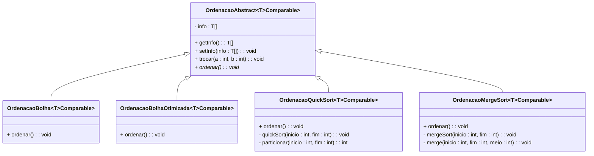

# Lista de Exercício 10

**UNIVERSIDADE REGIONAL DE BLUMENAU**  
Centro de Ciências Exatas e Naturais  
Departamento de Sistemas e Computação  
Professor Gilvan Justino  
Algoritmos e Estruturas de Dados

---

## Questão 1

O objetivo dessa questão é implementar os algoritmos de ordenação **bolha**, **bolha otimizada**, **quicksort** e **mergesort** de acordo com o diagrama abaixo.



Os algoritmos de ordenação devem ordenar o array `info`.

Na classe `OrdenacaoAbstract`, o método `trocar()` deve trocar a posição do elemento que está na posição **a** pelo elemento que está na posição **b** do array `info`. Reutilize o método `trocar()` nas classes de implementação concreta.

Observe que as classes utilizam uma notação diferente da que vimos até agora, para especificar que a classe é parametrizável.

A expressão `T>Comparable` tem o seguinte significado: a classe `OrdenacaoBolha` é uma classe parametrizável, cujo identificador do parâmetro se chama `T`, entretanto, quando o programador declarar uma variável do tipo `OrdenacaoBolha` deverá submeter como argumento uma classe que implemente a interface `Comparable`. Isto é, quando o programador informar um parâmetro para `OrdenacaoBolha` não poderá mais informar qualquer classe (como era até então). Com esta declaração, o programador precisará informar uma classe que realize a interface `Comparable`. Como a interface `Comparable` também é parametrizável, vamos fornecer `T` como parâmetro (por isso o `<T>` ao final).

Em Java, a tradução do primeiro compartimento da classe `OrdenacaoBolha` será assim:

```java
public class OrdenacaoBolha <T extends Comparable<T>> extends OrdenacaoAbstract<T>
```

Ou seja, a tradução de `>Comparable` foi introduzir `extends Comparable<T>` imediatamente antes de `>` da declaração do parâmetro de tipo. **Observação:** o uso da palavra reservada `extends`, neste contexto, não representa "herança", mas sim um requisito que pode ser realização ou herança.

Com esta declaração, estamos instruindo o compilador a recusar que o programador submeta qualquer classe como parâmetro para `OrdenacaoBolha`.

É importante compreender qual a razão de adicionarmos esta restrição. Nos algoritmos de ordenação, precisamos realizar a comparação entre dois elementos, por exemplo:

```
...
  se info[j] > info[j+1] então
    trocar(info, j, j+1);
...
```

Isto é, temos uma expressão que compara dois itens: `info[j]` e `info[j+1]`. Considerando que o vetor `info` armazena referências a objetos, o operador `>` (maior) não é aplicável para compará-los (este operador compara apenas números primitivos). Ora, se os objetos fossem da classe `Aluno` ou da classe `Veiculo`, por exemplo, como poderíamos compará-los, para identificar qual objeto é "menor" que o outro? Aqui é que entra a interface `Comparable`, que possibilita que um objeto seja comparado com outro objeto. Segue referência sobre sua finalidade:

https://docs.oracle.com/javase/9/docs/api/java/lang/Comparable.html

Com isso, a tradução do comando em pseudo-linguagem visto acima, seria em Java desta forma:

```java
if (getInfo()[j].compareTo(getInfo()[j+1]) > 0) { // se (info[j] > info[j+1]) então
    trocar(j, j+1);
}
```

---

## Questão 2

Implemente o seguinte plano de testes.

**Plano de testes PL01 – Validar funcionamento dos algoritmos de ordenação.**

| Caso | Descrição | Entrada | Saída esperada |
|------|-----------|---------|----------------|
| 1 | Validar algoritmo de ordenação Bolha | Criar um vetor constituído dos seguintes dados `[70,2,88,15,90,30]`. Instanciar a classe `OrdenacaoBolha`, submetendo o vetor criado. Invocar o método `ordenar()`. | O vetor deve conter os dados `[2,15,30,70,88,90]`, nesta ordem. |
| 2 | Validar algoritmo de ordenação bolha otimizado | Idem caso 1 | Idem caso 1. |
| 3 | Validar algoritmo de ordenação Quicksort | Idem caso 1, porém utilize a classe `OrdenacaoQuickSort` para ordenar os dados. | Idem caso 1. |
| 4 | Validar algoritmo de ordenação MergeSort | Idem caso 1, porém utilize a classe `OrdenacaoMergeSort` para ordenar os dados. | O vetor deve conter os dados `[2,15,30,70,88,90]`, nesta ordem. |