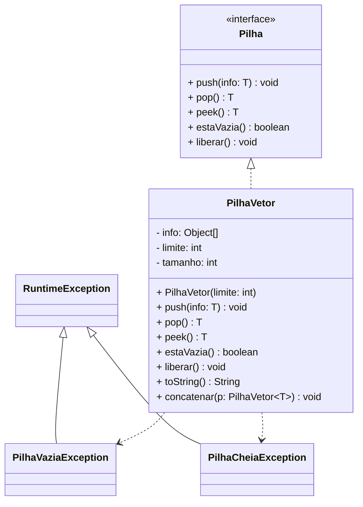
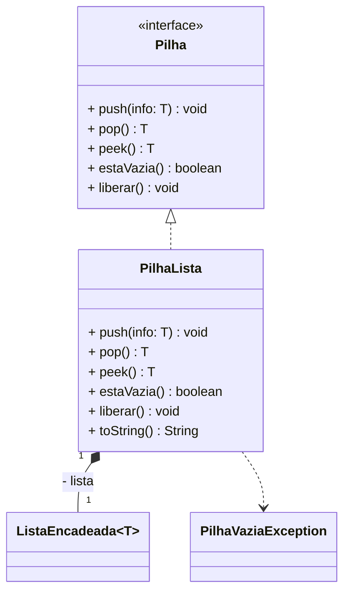

# Lista de Exercícios 05

**Universidade Regional de Blumenau**  
Centro de Ciências Exatas e Naturais  
Departamento de Sistemas e Computação  
Professor Gilvan Justino  
Algoritmos e Estruturas de Dados

---

O objetivo desta lista de exercícios é exercitar a implementação de pilhas. Crie um novo projeto para resolver as questões abaixo.

---

## Questão 1

O objetivo desta questão consiste em realizar a implementação de pilhas utilizando vetor, conforme diagrama abaixo.



Implemente a classe `PilhaVetor` conforme descrito a seguir:

a) `PilhaVetor()`: Construtor da classe. Deve inicializar o vetor `info` com o limite fornecido como argumento;

b) `push(T)`: Deve empilhar um valor na estrutura de dados. Se a pilha já estiver cheia, deve lançar exceção `PilhaCheiaException`;

c) `peek()`: Deve retornar o valor que estiver armazenado no topo da pilha. Caso a pilha esteja vazia, deve-se lançar exceção `PilhaVaziaException`;

d) `pop()`: Deve retirar o valor que estiver no topo da pilha e retornar seu valor à rotina chamadora. Se a pilha estiver vazia, deve lançar a exceção `PilhaVaziaException`;

e) `estaVazia()`: Deverá retornar `false` se existir algum dado empilhado e `true` se não possuir;

f) `liberar()`: deverá desempilhar todos os dados da pilha;

g) `toString()`: deverá retornar os dados armazenados na pilha, retornando o conteúdo do elemento que estiver no topo da pilha até sua base. Separe os valores por ",".

h) `concatenar(PilhaVetor)`: este método deverá concatenar os dados da pilha fornecida como argumento (`p`) na pilha corrente. O novo topo da pilha deve ser igual ao topo de `p`. Após a operação, a pilha `p` deve permanecer com o mesmo conteúdo antes da invocação de `concatenar()`. Se a pilha corrente não tiver capacidade de armazenar todos os dados da pilha `p`, deve ser lançada uma exceção.

---

## Questão 2

Implemente o seguinte plano de testes para validar sua implementação estática de pilha.

**Plano de testes PL01 – Validar funcionamento da implementação estática de pilha**

| Caso | Descrição | Entrada | Saída esperada |
|------|-----------|---------|----------------|
| 1 | Conferir se o método `estaVazia()` reconhece pilha vazia. | Criar uma pilha de inteiros. | Ao invocar `estaVazia()` deve resultar em `true`. |
| 2 | Conferir se o método `estaVazia()` reconhece pilha não vazia. | Criar uma pilha de inteiros com capacidade de 5 elementos. Empilhar o número 10. | Ao invocar `estaVazia()` deve resultar em `false`. |
| 3 | Conferir se os dados são empilhados e desempilhados corretamente. | Criar uma pilha de inteiros com capacidade de 10 elementos. Empilhar os dados 10, 20 e 30, nesta ordem. | Desempilhar um dado. Deve ser retornado 30. Desempilhar outro dado. Deve ser retornado 20. Desempilhar outro dado. Deve ser retornado 10. O método `estaVazia()` deve resultar em `true`. |
| 4 | Conferir se a exceção `PilhaCheiaException` é lançada ao tentar exceder a capacidade da pilha. | Criar uma pilha de inteiros com capacidade de 3 elementos. Empilhar os dados: 10, 20, 30 e 40. | A exceção `PilhaCheiaException` deve ser lançada. |
| 5 | Conferir se a exceção `PilhaVaziaException` é lançada ao tentar desempilhar dados de uma pilha vazia. | Criar uma pilha de inteiros. Desempilhar um dado. | A exceção `PilhaVaziaException` deve ser lançada. |
| 6 | Conferir se o método `peek()` retorna o topo da pilha. | Criar uma pilha de inteiros com capacidade de 5 elementos. Empilhar os dados 10, 20 e 30 (nesta ordem). Conferir o topo da pilha. | Deve retornar 30. Em seguida, retirar o último elemento da pilha. Deve resultar em 30. |
| 7 | Conferir se o método `liberar()` remove os elementos da pilha. | Criar uma pilha de inteiros com capacidade de 5 elementos. Empilhar os dados 10, 20, 30. Limpar a pilha. | O método `estaVazia()` deve resultar em `true`. |
| 8 | Conferir a concatenação de pilhas. | Criar uma pilha de inteiros e empilhar os dados 10, 20 e 30 (nesta ordem). Criar outra pilha de inteiros e empilhar os dados 40 e 50. Concatenar a segunda pilha na primeira. | Ao utilizar `toString()`, deve resultar em `50,40,30,20,10`. |

---

## Questão 3

Implemente o diagrama de classes a seguir para exercitar a manipulação de pilhas através de lista encadeada. Considere que a classe `ListaEncadeada` seja a implementação de lista simplesmente encadeada (copie as classes `ListaEncadeada` e `NoLista` para o projeto que você criou para esta lista de exercícios).



---

## Questão 4

Implemente o seguinte plano de testes para validar sua implementação dinâmica de pilha.

**Plano de testes PL02 – Validar funcionamento da implementação dinâmica de pilha**

| Caso | Descrição | Entrada | Saída esperada |
|------|-----------|---------|----------------|
| 1 | Conferir se o método `estaVazia()` reconhece pilha vazia. | Criar uma pilha de inteiros. | Ao invocar `estaVazia()` deve resultar em `true`. |
| 2 | Conferir se o método `estaVazia()` reconhece pilha não vazia. | Criar uma pilha de inteiros. Empilhar o número 10. | Ao invocar `estaVazia()` deve resultar em `false`. |
| 3 | Conferir se os dados são empilhados e desempilhados corretamente. | Criar uma pilha de inteiros. Empilhar os dados 10, 20 e 30, nesta ordem. | Desempilhar um dado. Deve ser retornado 30. Desempilhar outro dado. Deve ser retornado 20. Desempilhar outro dado. Deve ser retornado 10. O método `estaVazia()` deve resultar em `true`. |
| 4 | Conferir se o método `peek()` retorna o topo da pilha. | Criar uma pilha de inteiros. Empilhar os dados 10, 20 e 30 (nesta ordem). Conferir o topo da pilha. | Deve retornar 30. Em seguida, retirar o último elemento da pilha. Deve resultar em 30. |
| 5 | Conferir se o método `liberar()` remove os elementos da pilha. | Criar uma pilha de inteiros. Empilhar os dados 10, 20, 30. Limpar a pilha. | O método `estaVazia()` deve resultar em `true`. |

---

## Questão 5

Crie um programa que permita que o usuário informe uma expressão aritmética. Em seguida, avalie se o uso de delimitadores (isto é, de parênteses, colchetes e chaves) estão corretos.

**Exemplo:** supor que o usuário tenha digitado a expressão:

```
10 + [20 / (10 – 20)]
```

A aplicação deve indicar que o uso de delimitadores está **correta**.

Já para a expressão:

```
10 + [20 / (10 – 20])
```

A aplicação deve indicar que o uso de delimitadores está **incorreta**.